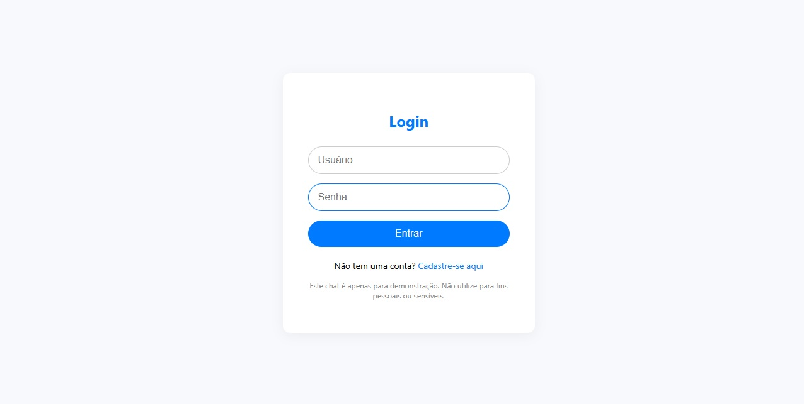
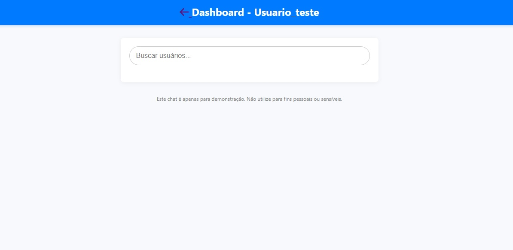
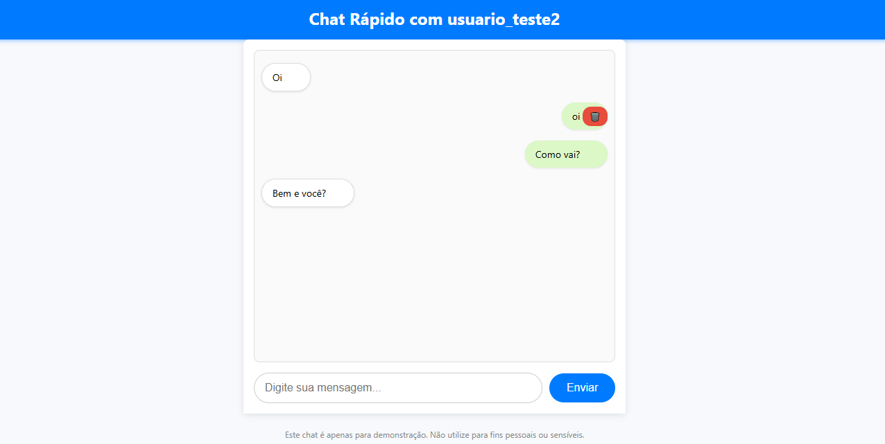

# Flask User Messaging System

A real-time private messaging application built with Flask, Socket.IO, and MySQL. The system supports user registration, login, and chat functionalities between authenticated users.

## 🔧 Features

- 🔐 User authentication (register, login)
- 🧑‍🤝‍🧑 Dashboard with live user search
- 💬 Private chat between users (real-time)
- 🗑️ Message deletion (with permission)
- 📱 Mobile-friendly responsive interface
- 🛠️ Built with Flask, Socket.IO, and MySQL

## 📸 Screenshots




## 🚀 Technologies Used

- Python 3.x
- Flask
- Flask-SocketIO
- Eventlet
- MySQL
- HTML5 / CSS3
- JavaScript (Vanilla)
- Font Awesome (icons)

## ⚙️ Setup & Installation

1. **Clone the repository**
   ```bash
   git clone https://github.com/seu-usuario/flask-user-messaging-system.git
   cd flask-user-messaging-system
